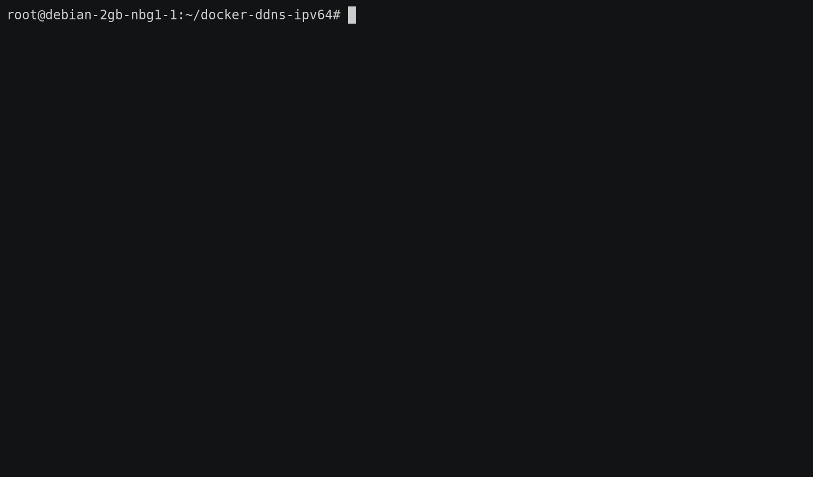

# docker-ddns-ipv64

[](https://drone.docker-for-life.de/alcapone1933/docker-ddns-ipv64)
[](https://drone.docker-for-life.de/alcapone1933/docker-ddns-ipv64/branches)
[](https://hub.docker.com/r/alcapone1933/ddns-ipv64/tags)

[](https://uptime.docker-for-life.de/status/ipv64-net)
&nbsp;

# DDNS Updater in Docker für Free DynDNS [IPv64.net](https://ipv64.net/) -NUR FÜR IPV4-

Dieser Docker Container ist ein DDNS Updater für Free DynDNS - ipv64.net.

Bei Änderung der ipv4 Adresse am Standort, wird die neue ipv4 Adresse als A-Record an ipv64.net geschickt.

Wenn sie dieses Docker Projekt nutzen möchten, ändern sie die Environments vor dem starten des Docker Containers.

&nbsp;

***

## Erklärung

### Domain

  * Hier bitte deine DOMAIN eintragen (ersetzen) die unter https://ipv64.net/dyndns.php erstellt wurde Z.B "deine-domain.ipv64.net"

    `-e "DOMAIN_IPV64=deine-domain.ipv64.net"`

  * Wenn sie mehrer DOMAINS eintragen wollen bitte mit Komma trennen

    `-e "DOMAIN_IPV64=deine-domain.ipv64.net,deine-domain.ipv64.de"`

&nbsp;

### Domain Praefix

  * Wenn sie einen DOMAIN PRAEFIX verwenden wollen, dann benutzen sie die Variable ***DOMAIN_PRAEFIX_YES=yes*** und ***DOMAIN_PRAEFIX***

    `-e "DOMAIN_PRAEFIX_YES=yes"`
  
  * Hier bitte nur ein DOMAIN PRAEFIX eintragen (ersetzen) der unter https://ipv64.net/dyndns.php erstellt wurde.

    `-e "DOMAIN_PRAEFIX=ddns"`

⚠️ ***Sollten sie mehrer DOMAINS verwenden bitte nur ein PRAEFIX eintragen (ersetzen)*** ⚠️

***Bei mehrern Domains würde es so ausehen, dass immer der selbe PRAEFIX werwendet wird.***

***z.B für die domains würde es so ausehen ddns.deine-domain.ipv64.net und ddns.deine-domain.ipv64.de***

&nbsp;

### Domain Key

  * Hier bitte dein DOMAIN KEY bzw. DynDNS Updatehash eintragen (ersetzen). Zu finden ist dieser unter https://ipv64.net/dyndns.php z.B "1234567890abcdefghijklmn"

    `-e "DOMAIN_KEY=1234567890abcdefghijklmn"`

&nbsp;

***

## Docker CLI

```bash
docker run -d \
    --restart always \
    --name ddns-ipv64 \
    -e "CRON_TIME=*/15 * * * *" \
    -e "CRON_TIME_DIG=*/30 * * * *" \
    -e "DOMAIN_IPV64=deine-domain.ipv64.net" \
    -e "DOMAIN_KEY=1234567890abcdefghijklmn" \
    alcapone1933/ddns-ipv64:latest


    -e "DOMAIN_IPV64=deine-domain.ipv64.net,deine-domain.ipv64.de" \
    -e "DOMAIN_PRAEFIX_YES=yes" \
    "⚠️ Hier bitte nur ein DOMAIN PRAEFIX eintragen (ersetzen) ⚠️"
    -e "DOMAIN_PRAEFIX=ddns" \
```

## Docker Compose

```yaml
version: "3.9"
services:
  ddns-ipv64:
    image: alcapone1933/ddns-ipv64:latest
    container_name: ddns-ipv64
    restart: always
    environment:
      - "TZ=Europe/Berlin"
      # Standard Abfrage Alle 15 Minuten nach der aktuellen ip
      - "CRON_TIME=*/15 * * * *"
      # Standard Abfrage Alle 30 Minuten für die Domain Adresse 
      - "CRON_TIME_DIG=*/30 * * * *"
      #  Hier bitte deine DOMAIN eintragen (ersetzen) die unter https://ipv64.net/dyndns.php erstellt wurde Z.B "deine-domain.ipv64.net"
      - "DOMAIN_IPV64=deine-domain.ipv64.net"
      #  Wenn sie mehrer DOMAINS eintragen wollen bitte mit Komma trennen
      # "DOMAIN_IPV64=deine-domain.ipv64.net,deine-domain.ipv64.de"
      # Damit wird der Domain PRAEFIX aktiv genutzt
      # - "DOMAIN_PRAEFIX_YES=yes"
      # ⚠️ Hier bitte nur ein DOMAIN PRAEFIX eintragen (ersetzen) der unter https://ipv64.net/dyndns.php erstellt wurde ⚠️
      # - "DOMAIN_PRAEFIX=ddns"
      #  Hier bitte dein DOMAIN KEY bzw. DynDNS Updatehash eintragen (ersetzen). Zu finden ist dieser unter https://ipv64.net/dyndns.php z.B "1234567890abcdefghijklmn"
      - "DOMAIN_KEY=1234567890abcdefghijklmn"

```

&nbsp;

***

## Volume Parameter

| Name (Beschreibung) #Optional | Wert    | Standard              |
| ----------------------------- | ------- | --------------------- |
| Speicherort logs und Script   | volume  | ddns-ipv64_data:/data |
|                               |         | /dein Pfad:/data      |

&nbsp;

## Env Parameter

| Name (Beschreibung)                                                                            | Wert               | Standard           | Beispiel                                     |
| ---------------------------------------------------------------------------------------------- | ------------------ | ------------------ | -------------------------------------------- |
| Zeitzone                                                                                       | TZ                 | Europe/Berlin      | Europe/Berlin                                |
| Zeitliche Abfrage für die aktuelle IP                                                          | CRON_TIME          | */15 * * * *       | */15 * * * *                                 |
| Zeitliche Abfrage auf die Domain (dig DOMAIN_IPV64 A)                                          | CRON_TIME_DIG      | */30 * * * *       | */30 * * * *                                 |
| DOMAIN KEY: DEIN DOMAIN KEY bzw. DynDNS Updatehash zu fiden unter https://ipv64.net/dyndns.php | DOMAIN_KEY         | ------------------ | 1234567890abcdefghijklmn                     |
| DEINE DOMAIN:  z.b. deine-domain.ipv64.net zu fiden unter         https://ipv64.net/dyndns.php | DOMAIN_IPV64       | ------------------ | deine-domain.ipv64.net                       |
| DEINE DOMAINS: z.b. deine-domain.ipv64.net,deine-domain.ipv64.de                               | DOMAIN_IPV64       | ------------------ | deine-domain.ipv64.net,deine-domain.ipv64.de |
| DOMAIN PRAEFIX YES: Damit wird der Domain PRAEFIX aktiv genutzt                                | DOMAIN_PRAEFIX_YES | no                 | yes                                          |
| DEIN DOMAIN PRAEFIX: ⚠️ Nur ein Praefix verwenden ⚠️ z.b. ddns                               | DOMAIN_PRAEFIX     | ------------------ | ddns                                         |


* * *

&nbsp;

## DEMO



